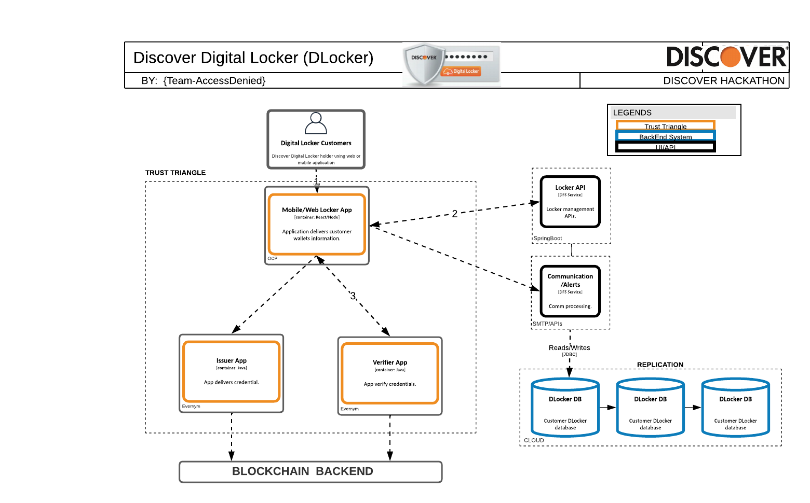

# Discover Digital Locker Recovery (DLocker)

#### Table of Contents
- [Discover Digital Locker Recovery](#discover-digital-locker-recovery) 
      - [Table of Contents](#table-of-contents)
  - [Acknowledgements](#acknowledgements)
  - [Business Challenge](#business-challenge)
    - [Concept](#concept)
    - [Approach](#approach)
  - [Vernacular](#vernacular)
  - [Assumptions](#assumptions)
  - [Persona](#persona)
  - [Story](#story)
  - [Demo Workflow](#demo-workflow)
    - [Step 1](#step-1)
    - [Step 2](#step-2)

 
## Acknowledgements

1. This scenario leverages increase in digital wallet transactions and offerings by different businesses. Discover Digital Locker Recovery is subsidiary of DFS company and is called, _D Locker_. The  DLocker logo is designed by Pranav.
2. Recovery of digital wallet idea came from Chandra who wanted to provide ways to reclaim wallet in case customer mobile is lost.
 
## Business Challenge
>DLocker customer who lost there phone. Now, when they got new phone and wanted to recover Digital wallets which were store in DLocker. As of now process to restore any wallet/identity is very tailor made based on which kind of institition involved. Customer has to follow each institution guidelines to restore wallets.The world is changing to digital and there is no TRUE Digital Locker available in the market. We have vendor specific lockers to store computer hardware related keys or lockers that stores the uploaded documents in digital format. But there is none available which securely store the recovery material and positively identify the identity owner in a decentralized way. People can’t remember all the keys and the physical copy of them are vulnerable. They need a reliable and secure backup. The Digital locker is filling this void space for digital backup. When the mobile device is lost, the holder need not go to each and every issuer to get the IDs reissued. He can just go to Discover Locker to reissue the ID and with that it can access his lost wallet and identities inside of it.

 
### Concept
>DLocker uses trust triangle to recover customers digital wallets. DLocker issuer issues distributed identities for customer at time of locker account opening. Distributed identity is used for locker access and recovery. This solution is important because it provides a fully secured implementation for digital backup of digital wallet in the decentralized ID world.  Customers can be worry free about the data they have on their digital wallet during phone loss or compromise. It provides an opportunity to DFS to lead the digital bank by providing this feature.
  
 
### Approach
>Below is high level components and there interaction. DLocker customer who wants to restore his digital wallet follow below steps:
>1. DLocker Customer - Customer who has digital wallets and wanted to access, store and recover in case of lost.
>2. DLocker App - Holder of the trust traingle, provides locker access and recover functionality.
>3. Issuer App - Deliveres trust triangle credentials and issue distributed identities.
>4. Verifier App - Third entity of the trust triangle verifies distributed identity for DLocker csutomer.

 
## Vernacular

>Template Instructions: List and describe any terms that will be used in the story and referenced in the UML diagrams. The current list provides a a sample starter list. 
 
1. **Digital Locker**: A financial transaction application that runs on multiple device modalities (mobile, computer). These applications store, manage, and present payment and identity instruments.
2. **DLocker API**: A service which provides locker management services for locker customers. Storing distributed identities and customer transaction for locker access.
3. **Communication**: A service which provides alerts and email communication for locker customers. Temporary phrash communication etc. in case of wallet recovery.
4. **DLocker Database**: A cloud data storager service, which will store customer DIDs, locker information and associated wallet data.
5. **Verifier App**: A merchant (e.g. Evernym) would augment their Checkout Platform with support by a vendor solution that allows consumers to: (a) consent to a digital authentication challenge; (b) present a digital credential for identity verification.
6. **Issuer App**: A entity ((e.g. Evernym)) that makes assertions about information and delivers digital credentials containing attestations about those assertions. A software component used by the Issuer to manage the generation of new digital credentials.

## Assumptions

>Template Instructions: List any assumptions to be considered in this use case story.
 
1. Use case assumes knowledge of the W3C Standards and open source software that supports the concepts outlined by the [Trust over IP Foundation](https://trustoverip.org/toip-model/).
2. Credential Issuer and Verifier Utility solutions are readily available from 3rd party vendors.
 
## Persona

>Template Instructions: Using the sample persona images in the /images folder, describe the roles of the entities involved in this use case story. The current list provides a a sample starter list. Refer to ./HELP.md#digital-trust-use-cases for example usage.
 
| Actor | Role | Goals | Details |
| --- | --- | --- | --- |
|  | Verifier |  |  |
|   Acme Enterprise | Issuer |  |  |
|  Angelica | Consumer |  |  |
 
## Story
>Template Instructions: Using the sample persona images in the /images folder, describe the steps that are involved in the interactive use case story. Refer to ./HELP.md#digital-trust-use-cases for example usage.
 
*  Acme Enterprise decided to issue a XYZ credential. 
 
## Demo Workflow

>Template Instructions: Using the sample persona images in the /images folder, describe the steps od the use case story as they relate to the UML diagram. Refer to ./HELP.md#digital-trust-use-cases for example usage. If desired, a single diagram can be used instead of multiple steps. 
 
### Step 1
 Acme Enterprise and  register their DIDs.
 

 
### Step 2
 
 challenges  Angelica for a credential.
 

 
