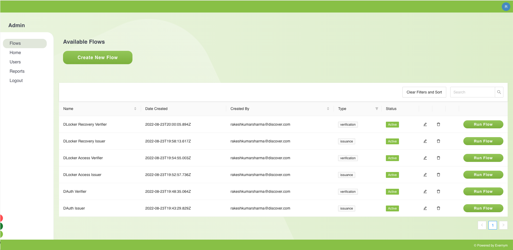
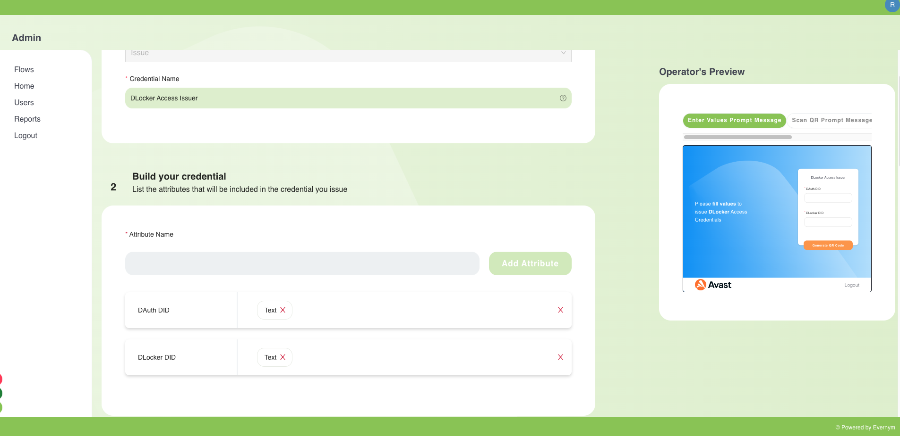
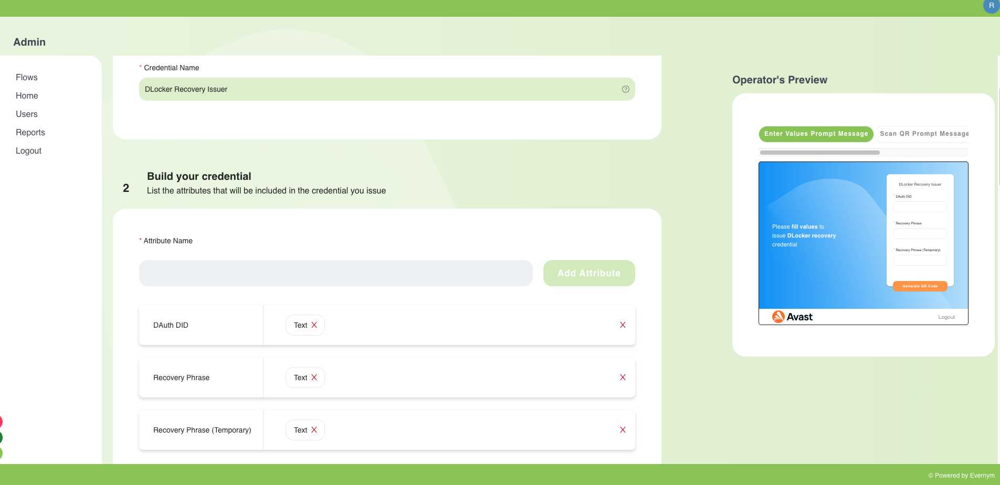
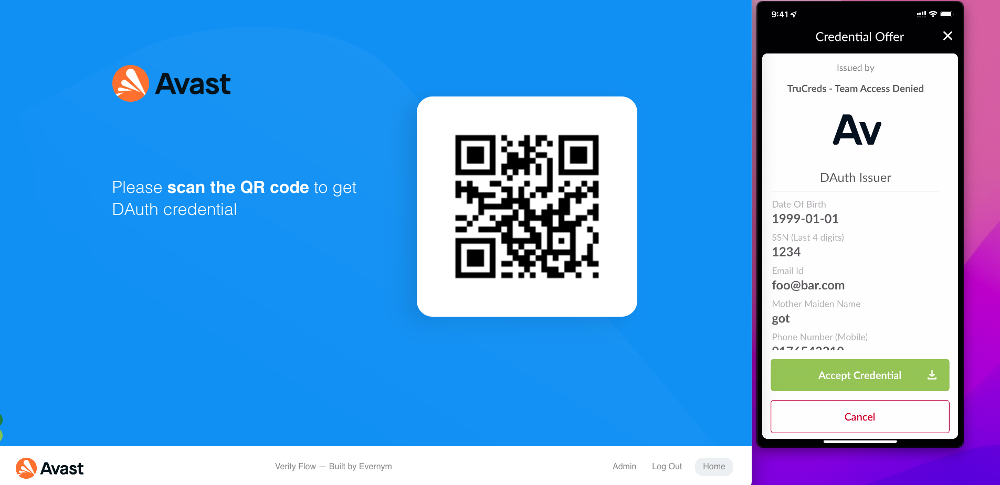
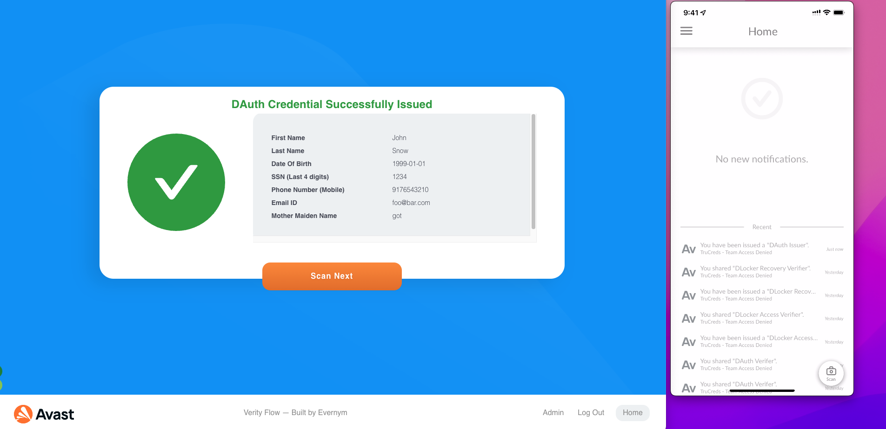

# DLocker Prototype Documentation

### Prepare Environment
* Completed. See below verify flow for dLocker prototype.

* dLocker Verity flows used

### Use Case Process Steps 

#### 1: Create Issuer for dLocker - 3 issuer we have created 

| S. No. | Issuer Name | Issuer Description |
| --- | --- | --- |
| 1 | DAuth | Consists of customer PII information |
| 2 | DLocker Access | Consists of DAuth + Locker DID |
| 3 | DLocker Recovery |Consists of DAuth + Recovery phrase |

   * DAuth Issuer Attributes
   

   * DLocker Access Issuer Attributes
   

   * DLocker Recovery Issuer Attributes
   

### 2: DAuth issues DLocker Credential
   
   * DAuth Issuer Scan
   

### 3: Display DAuth issuer details 

   * DAuth Issuer details
   

### 4: Create DAuth Verifier

   * DAuth Verifier Scan
   

### 5: ABC verifies Employee Credential 

   * DAuth Verified Scan
   
